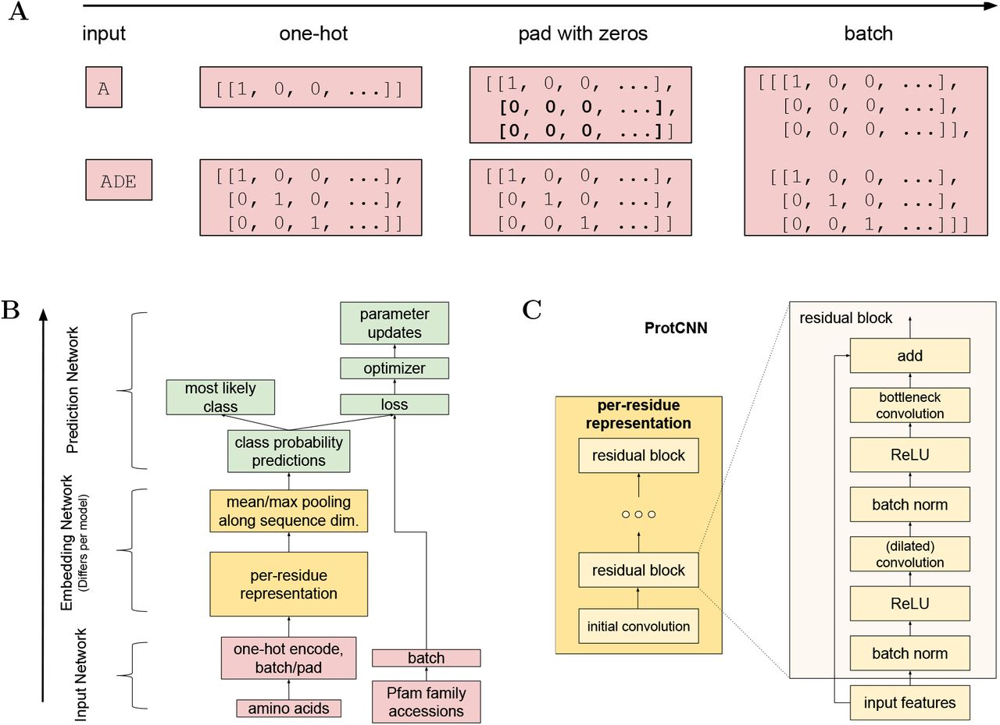

# Pfam datatset

## Description :

### Folders :

* *Data analysis* : containing a Notebook for the data analysis part with charts
* *Data*: functions for data processing before training the model
    * get_dataset.py to collect data from folders
    * features.py containg preprocessing functions 
* *Model* : 
  * classifier.py containing functions to build the 2 models and train them
## Dataset analysis :

Jupyter Notebook in folder "data_analysis" . 

## Classifier 

- First model : Naïve approch with LSTM 

**Accuracy** : 91%

- Second model : CNN with a recurrent block 

**Accuracy** : 98 %

Model inspired by paper : https://www.biorxiv.org/content/10.1101/626507v4.full

## Running :

* main.py to run the 2nd model
* main.ipynb is a Jupiter Notebook illustrating the 2 models respective performances

